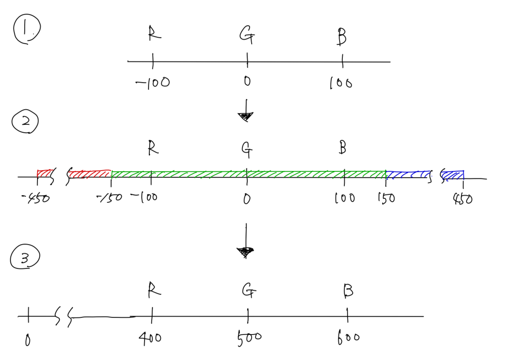

### ABC004

# D - マーブル

  [問題はこちら](https://atcoder.jp/contests/abc004/tasks/abc004_4)

- 発想<br>
  <br>
  上図 1 は、問題に基づいて 赤いマーブルが入った箱（R）、緑のマーブルが入った箱（G）、青のマーブルが入った箱（B）を直線上に置いたイメージ。<br>
  最小の操作回数を実現するには、R、G、B のマーブルそれぞれを連続して配置する必要がある。<br>
  R、G、B がすべて最大 300 個だった場合において、最小の操作回数で各色のマーブルを移動させた状態は上図の 2 のようになる。<br>
  そこで、-500 を 0 と考えて、R、G、B の位置を変更すると、上図 3 のようになる。<br>
  そして、dp[マーブルを置く位置][残りのマーブル] = 最小の移動回数で、DPを行う。<br>
  最小の移動回数を求めるので初期値は大きい値にしておき、<br>
  残りのマーブルの数が、R + G + B のときは最小の移動回数は 0 であることはわかっているので入れておく。<br>
  マーブルを置く位置を 0 から 1000 までの範囲で考えれば、今回の問題の範囲は確認することができる。<br>
  i の位置から R → G → B とマーブルを順番に見ていけばいいので、各マーブルの移動回数は R、G、B の箱の位置と i の位置の絶対値で計算することができる。（コードのcost関数）<br>
  また、DPの漸化式は、i番目にマーブルを置かなかった場合と、マーブルを置いた場合で小さい方を採用すればいいので、<br>
  dp[i][j] = min(dp[i - 1][j], dp[i - 1][j + 1] + cost(i, j));となる。<br>
  そして、マーブルを全部置いたとき(j = 0)の最小値が答えになる。


- コード（C++）

  ```cpp
  #include <bits/stdc++.h>
  using namespace std;

  long long INF = 1000000000000;
  int R, G, B;

  long long cost(long long pos, long long count) {
    if (G + B <= count) {
      // R を配置したときの移動回数
      return abs(400 - pos);
    } else if (B <= count) {
      // G を配置したときの移動回数
      return abs(500 - pos);
    } else {
      // B を配置したときの移動回数
      return abs(600 - pos);
    }
  }

  int main() {

    cin >> R >> G >> B;

    // dp[マーブルを置く位置][残りのマーブル]
    // 大きい数で初期化
    vector<vector<long long>> dp(1000, vector<long long>(R + G + B + 1, INF));

    // j が R + G + B のときは移動しないので全部 0
    for (int i = 0; i < 1000; i++) {
      dp[i][R + G + B] = 0;
    }

    for (int i = 1; i < 1000; i++) {
      for (int j = 0; j < R + G + B; j++) {
        // i番目にマーブルを置かなかった場合と、マーブルを置いた場合で小さい方を採用
        dp[i][j] = min(dp[i - 1][j], dp[i - 1][j + 1] + cost(i, j));
      }
    }

    long long answer = INF;

    // マーブルを全部置いたとき(j = 0)の最小値が答え
    for (int i = 0; i < 1000; i++) {
      answer = min(answer, dp[i][0]);
    }

    cout << answer << endl;

  }
  ```
