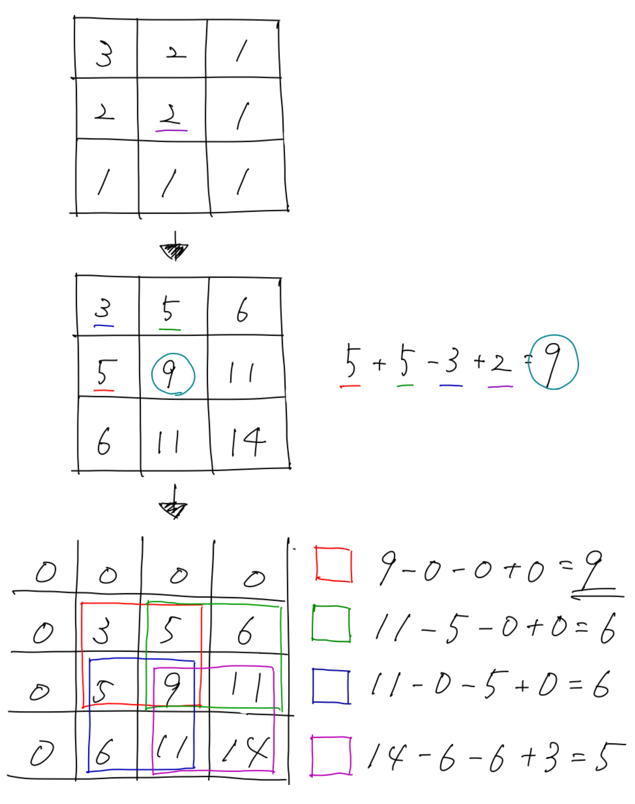

### ABC005

# D - おいしいたこ焼きの焼き方

  [問題はこちら](https://atcoder.jp/contests/abc005/tasks/abc005_4)

- 発想<br>
  例えば、N = 3 で、1 度に焼くことができるたこ焼きの上限が 4 個を考えるとすると、<br>
  3 × 3 マスから 2 × 2 マスを取るには、4 パターン考えられる。<br>
  これらの 4 パターン全てについて、おいしさの合計を計算し、最大値を求める。<br>
  以上の作業を 1 度に焼くことができるたこ焼きの上限が 1 から N まで全部計算する。<br>
  計算量を少なくするために、あらかじめ（0,0）から（N,N）までのおいしさの合計値を計算しておく（二次元累積和）。<br>
  そして、各長方形のおいしさの合計を累積和から計算し、最大値を探す。<br>
  以上の流れを入力例 1 で、1 度に焼くことができるたこ焼きの上限が 4 個の場合を考えたときのイメージが下図である。<br>
  <br>
  また、1 度に焼くことができるたこ焼きの上限が 4 個の場合でも 3 個の場合の方がおいしさの最大値が大きい場合もあるので注意する。

- コード（C++）

  ```cpp
  #include <bits/stdc++.h>
  using namespace std;

  int main() {

    int N;
    cin >> N;

    vector<vector<int>> D(N+1, vector<int>(N+1));
    for (int i = 1; i <= N; i++) {
      for (int j = 1; j <= N; j++) {
        cin >> D[i][j];
      }
    }

    int Q;
    cin >> Q;

    vector<int> P(Q);
    for (int i = 0; i < Q; i++) {
      cin >> P[i];
    }

    // 二次元累積和
    // 面積ごとのおいしさ
    vector<vector<int>> S(N+1, vector<int>(N+1));
    for (int i = 1; i <= N; i++) {
      for (int j = 1; j <= N; j++) {
        S[i][j] += S[i][j-1] + S[i-1][j] - S[i-1][j-1] + D[i][j];
      }
    }

    // たこ焼きの数ごとのおいしさの最大値を求める O(N^4)
    vector<int> dp(3000);
    for (int i = 0; i < N; i++) {
      for (int j = 0; j < N; j++) {
        for (int k = i + 1; k < N + 1; k++) {
          for (int l = j + 1; l < N + 1; l++) {
            int pos = (k - i) * (l - j);
            dp[pos] = max(dp[pos], S[k][l] - S[i][l] - S[k][j] + S[i][j]);
          }
        }
      }
    }

    // たこ焼きの数ごとに、i より小さい数のほうがおいしさが大きくなるときはおいしさを書き換える
    for (int i = 1; i < 3000; i++) {
      dp[i] = max(dp[i], dp[i-1]);
    }

    // 各定員ごとにおいしさの最大値を出力する
    for (int i = 0; i < Q; i++){
      cout << dp[P[i]] << endl;
    }

    return 0;

  }
  ```
