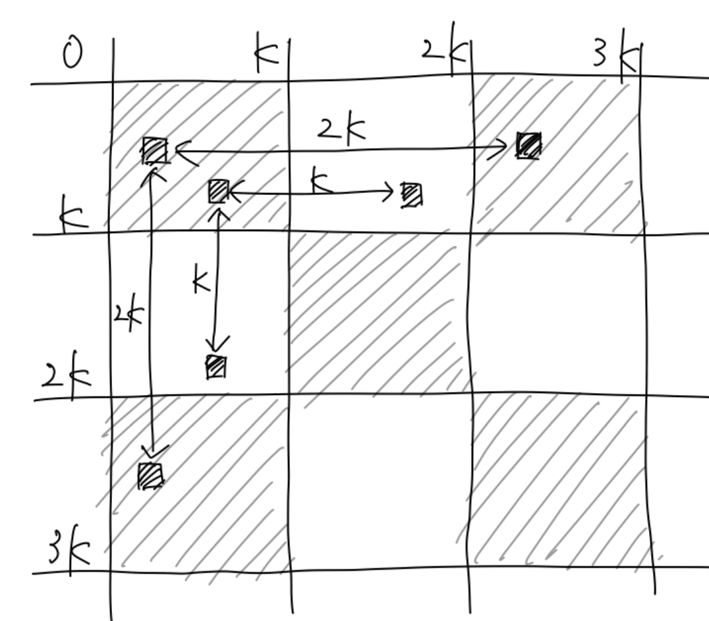
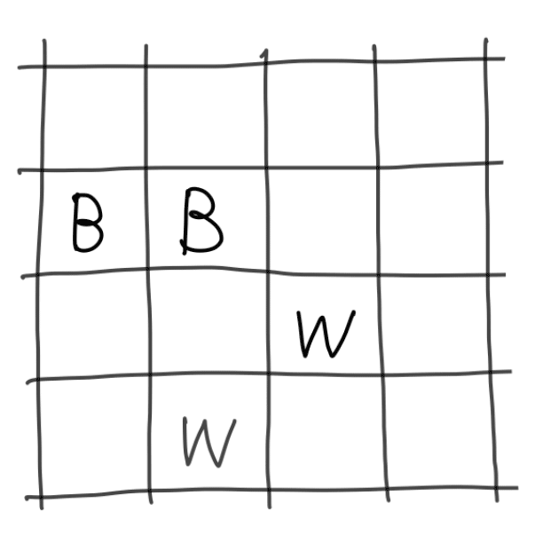
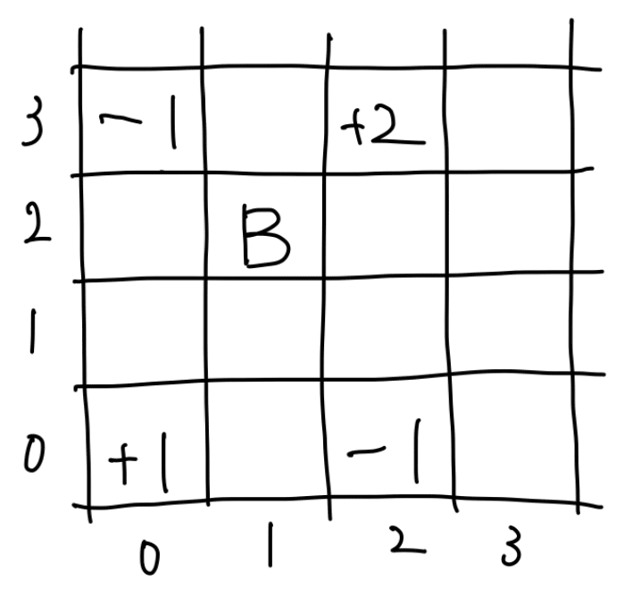
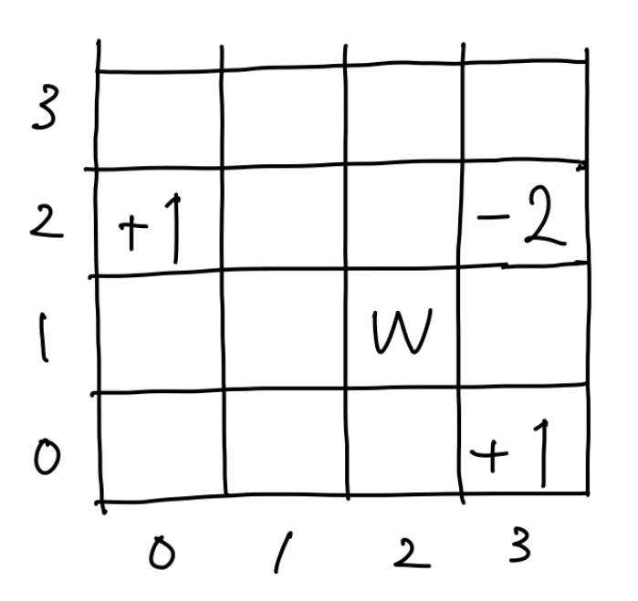
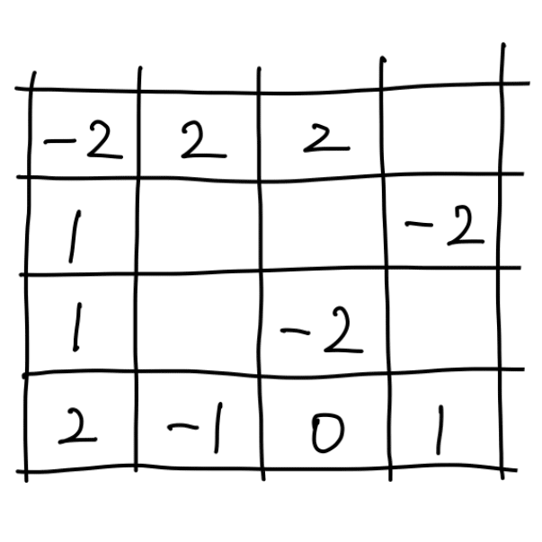
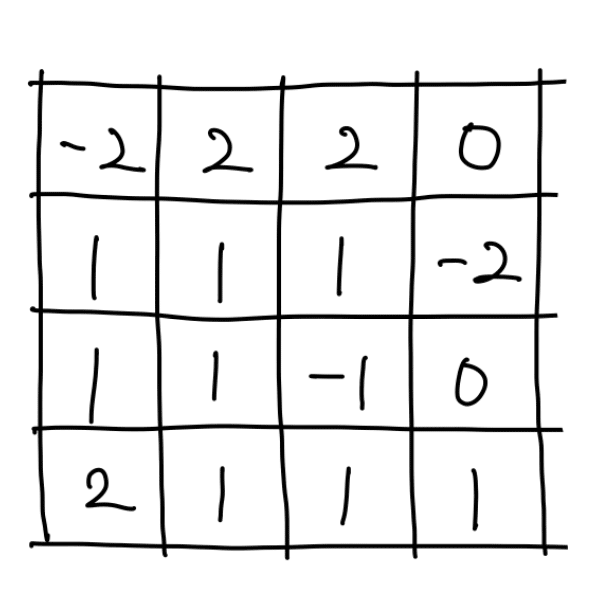
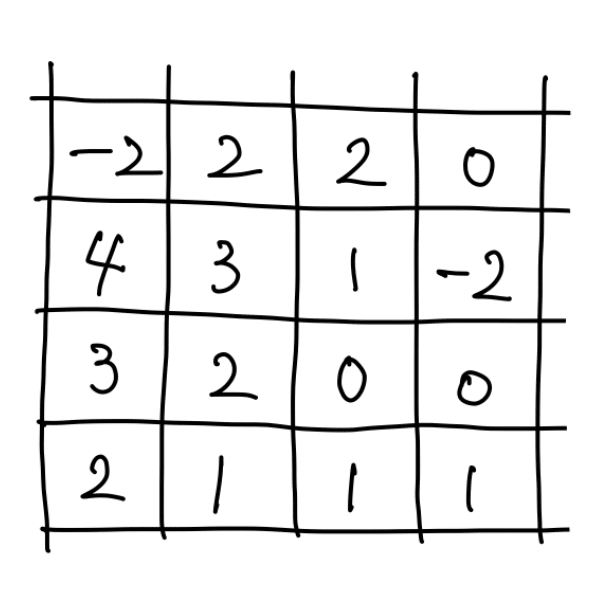

### ABC086

# D - Checker

  [問題はこちら](https://atcoder.jp/contests/abc086/tasks/arc089_b)

## 発想

  ### 1. x と y が大きいの集客する

  <br>

  上図より、<br>
  ・「(x, y) が B である」ということは「(x - 2K, y) は B である」<br>
  ・「(x, y) が B である」ということは「(x, y - 2K) は B である」<br>
  ・「(x, y) が B である」ということは「(x - 2K, y - 2K) は B である」<br>
  すなわち、<br>
  **(x,y) と (x % 2k, y % 2K) の結果は同じである** <br>
  とわかる。

  また、上図より、<br>
  ・「(x1, y1) が W である」ということは「(x1 - K, y1) は B である」<br>
  ・「(x2, y2) が B である」ということは「(x2, y2 - K) は W である」<br>
  ・「(x1, y1) が W である」ということは「(x1 - K, y1 - K) は W である」<br>
  すなわち、<br>
  **・(x,y) と (x - K, y) の結果は逆になる**<br>
  **・(x,y) と (x, y - K) の結果は逆になる**<br>
  **・(x,y) と (x - K, y - K) の結果は同じになる**<br>
  とわかる。<br>

  以上を利用すると、x と y が大きい数の場合でも余りに置き換えたり、K を引くことで、<br>
  **すべての (x,y) を 0 から K の中に収めて考えることができる**。

  以上の考えを元に、例えば【入力例１】は下図のように、すべての (x,y) を 0 から K に集約することができる。（以下すべて図は左下が (0,0) 右上が(K,K)である。）<br>
  <br>

  上図を利用して、K * K の左下の位置が (i, j) であった場合に、B や W のうち正しいものは何個か？を、
   (0, 0) から (K, K) まで全パターン試す。計算量は O(K^2) となる。<br>

  ここで、 (0, 0) から (K, K) までで B や W が何個含まれているのかを効率的に数えるために、**二次元累積和** を使う。この問題の場合 B か W かで累積和の設定方法が異なる。<br>

  ### 2. 二次元累積和をするための値を設定する<br>

  例えば、(2,1) が B である場合を考えると、下図のように数値を設定する。<br>
  <br>
  ・K * K の左下の位置が (0, 0) であった場合は、B は正しいので、(0, 0) に + 1 する。<br>
  ・K * K の左下の位置が (3, 0) であった場合は、B は正しくないで、(3, 0) に - 1 する。<br>
  ・K * K の左下の位置が (0, 2) であった場合は、B は正しくないで、(0, 2) に - 1 する。<br>
  ・K * K の左下の位置が (3, 2) であった場合は、B は正しいので、(3, 2) に + 2 する。<br>

  すなわち、(x,y) が B である場合は、<br>
  **・(0, 0) に + 1 する**<br>
  **・(x + 1, 0) に - 1 する**<br>
  **・(0, y + 1) に - 1 する**<br>
  **・(x + 1, y + 1) に + 2 する** （- 1 をキャンセルし、+ 1 を加えるイメージ）。<br>

  (1,2) が W である場合を考えると、下図のように数値を設定する。<br>
  <br>
  ・K * K の左下の位置が (2, 0) であった場合は、W は正しいで、(2, 0) に + 1 する。<br>
  ・K * K の左下の位置が (0, 3) であった場合は、W は正しいで、(3. 0) に + 1 する。<br>
  ・K * K の左下の位置が (2, 3) であった場合は、W は正しくないで、(2, 3) に - 2 する。<br>

  すなわち、(x,y) が W である場合は、<br>
  **・(x + 1, 0) に + 1 する**<br>
  **・(0, y + 1) に + 1 する**<br>
  **・(x + 1, y + 1) に - 2 する**（+ 1 をキャンセルし、- 1 を加えるイメージ）。<br>

  <br>
  上図のすべての B と W について数値を設定すると、下図のようになる。<br>
  <br>

  ### 3. 二次元累積和（1）横方向を集計する<br>

  横を集計する場合は、0 から K - 1 まで i + i - 1 で足していく。<br>
  <br>

  ### 4. 二次元累積和（2）縦方向を集計する<br>

  縦を集計する場合は、0 から K - 1 まで i + i - 1 で足していく。<br>
  <br>

  ### 5. 値の最大値を探す

  以上で、K * K の左下の位置が (i, j) であった場合に、B や W が何個正しいのか？は、
   (i, j) の値か N - 値の大き方となるので、これらの最大値を探せばいい。


## コード（C++）

  ```cpp
  #include <bits/stdc++.h>
  using namespace std;


  int main() {

    int N, K;
    cin >> N >> K;

    vector<int> x(N);
    vector<int> y(N);
    vector<char> c(N);

    // 黒か否か
    vector<bool> black(N);

    // 2 * K
    int KK = 2 * K;

    // 二次元累積和
    vector<vector<int>> table(KK + 1, vector<int>(KK + 1));

    for (int i = 0; i < N; i++) {
      cin >> x[i] >> y[i] >> c[i];

      // x を x % 2K、y を y % 2K に置き換える
      x[i] %= KK;
      y[i] %= KK;

      if (c[i] == 'B') {
        black[i] = true;
      } else {
        black[i] = false;
      }

      // 0 から K の間に (x, y) を集約させる
      if (K <= x[i]) {
        x[i] -= K;
        black[i] = !black[i];
      }
      if (K <= y[i]) {
        y[i] -= K;
        black[i] = !black[i];
      }

      // 二次元累積和の準備
      // K * k の左下を調査点とする
      if (black[i]) {
        table[0][0]++;
        table[0][y[i] + 1]--;
        table[x[i] + 1][0]--;
        table[x[i] + 1][y[i] + 1] += 2;
      } else {
        table[0][y[i] + 1]++;
        table[x[i] + 1][0]++;
        table[x[i] + 1][y[i] + 1] -= 2;
      }

    }

    // 二次元累積和（横の集計）
    for (int i = 0; i < K; i++) {
      for (int j = 1; j < K; j++) {
        table[i][j] += table[i][j - 1];
      }
    }

    // 二次元累積和（縦の集計）
    for (int i = 0; i < K; i++) {
      for (int j = 1; j < K; j++) {
        table[j][i] += table[j - 1][i];
      }
    }

    int answer = 0;

    // 答えを探す
    for (int i = 0; i < K; i++) {
      for (int j = 0; j < K; j++) {
        // 正しいマスの個数は、W が多い場合もある
        table[i][j] = max(table[i][j], N - table[i][j]);
        answer = max(answer, table[i][j]);
      }
    }

    cout << answer << endl;

    return 0;

  }
  ```
