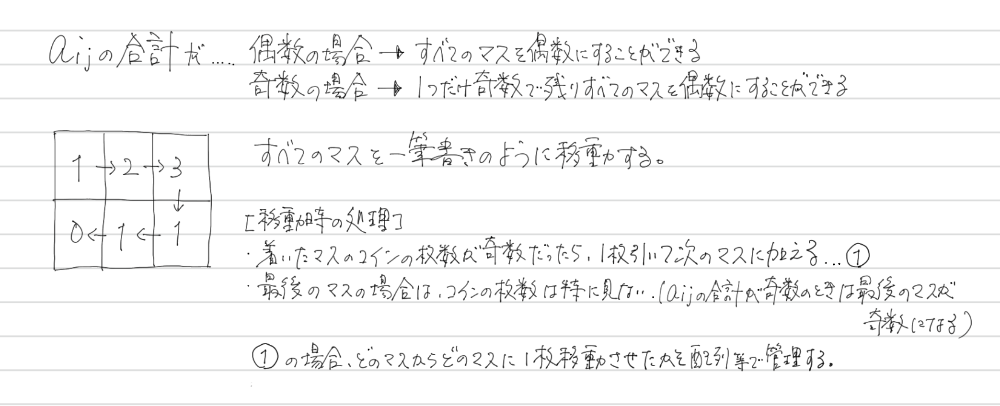

### ABC109

# D - Make Them Even

  [問題はこちら](https://atcoder.jp/contests/abc109/tasks/abc109_d)


## 発想

  


## コード（C++）

  ```cpp
  #include <bits/stdc++.h>
  using namespace std;

  int main() {

    int H, W;
    cin >> H >> W;

    vector<vector<int>> a(H,vector<int>(W));
    for (int i = 0; i < H; i++) {
      for (int j = 0; j < W; j++) {
        cin >> a[i][j];
      }
    }

    int add = 0;
    int x = -1;
    int y = -1;
    vector<string> answer;

    for (int i = 0; i < H; i++) {
      if (i % 2 == 0) {
        for (int j = 0; j < W; j++) {
          if (add == 1) {
            a[i][j] += add;
            string ans = to_string(y) + " " + to_string(x) + " " + to_string(i + 1) + " " + to_string(j + 1);
            answer.push_back(ans);
          }
          if (a[i][j] % 2 == 1) {
            if (i != H - 1 || j != W - 1) {
              add = 1;
              a[i][j]--;
              x = j + 1;
              y = i + 1;
            }
          } else {
            add = 0;
          }
        }
      } else {
        for (int j = W - 1; 0 <= j; j--) {
          if (add == 1) {
            a[i][j] += add;
            string ans = to_string(y) + " " + to_string(x) + " " + to_string(i + 1) + " " + to_string(j + 1);
            answer.push_back(ans);
          }
          if (a[i][j] % 2 == 1) {
            if (i != H - 1 || j != 0) {
              add = 1;
              a[i][j]--;
              x = j + 1;
              y = i + 1;
            }
          } else {
            add = 0;
          }
        }
      }
    }

    cout << answer.size() << endl;

    for (int i = 0; i < answer.size(); i++) {
      cout << answer[i] << endl;
    }

    return 0;
  }
  ```
