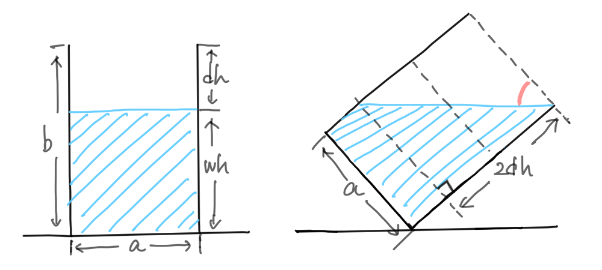

### ABC144

# D - Water Bottle

  [問題はこちら](https://atcoder.jp/contests/abc144/tasks/abc144_d)

- 発想<br>
  水の高さが水筒の高さの1/2以上か否かで直角三角形の辺が下図のように分岐する。<br>
  
  水の高さが水筒の高さの1/2以上の場合
  
  
  
  水の高さが水筒の高さの1/2未満の場合
   

- 実装のポイント<br>
  
  

- コード（C++）

  ```cpp
  #include <bits/stdc++.h>
  using namespace std;

  int main() {

    double a, b, x;
    cin >> a >> b >> x;

    double answer = 0.0;
    double rangle = 0.0;

    double wh = x / (a * a); 
    double dh = b - wh;

    if (dh <= wh) {

      rangle = atan2(dh * 2, a);
      answer = rangle * 180.0 / M_PI;

    } else {

      double ab = a * b;
      double x2 = 2 * x;
      double a2 = x2 / ab;
      rangle = atan2(a2, b);
      answer = rangle * 180.0 / M_PI;
      answer = 90 - answer;

    }

    cout << setprecision(12) << answer << endl; 

  }
  ```

- コード（Java）

  ```java
  import java.util.*;

  public class Main {

    public static void main (String[] args) {

      Scanner sc = new Scanner(System.in);
      double a = sc.nextDouble();
      double b = sc.nextDouble();
      double x = sc.nextDouble();
      sc.close();

      double answer = 0.0;
      double rangle = 0.0;

      double wh = x / (a * a); 
      double dh = b - wh;

      if (dh <= wh) {

        rangle = Math.atan2(dh * 2, a);
        answer = rangle * 180.0 / Math.PI;

      } else {

        double ab = a * b;
        double x2 = 2 * x;
        double a2 = x2 / ab;
        rangle = Math.atan2(a2, b);
        answer = rangle * 180.0 / Math.PI;
        answer = 90 - answer;

      }

      System.out.println(answer);

    }

  }
  ```
    