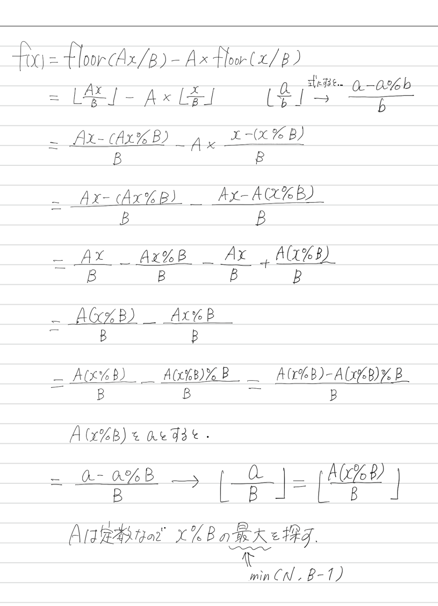

### ABC165

# D - Floor Function

  [問題はこちら](https://atcoder.jp/contests/abc165/tasks/abc165_d)


## 発想

  <p></p>


## コード（C++）

```cpp
#include <bits/stdc++.h>
using namespace std;

int main() {

  long long A, B, N;
  cin >> A >> B >> N;

  long long x;
  x = min(N, B - 1);
  x %= B;

  A *= x;

  long long answer = (A - A % B) / B;
  cout << answer << endl;

  return 0;
}
```
